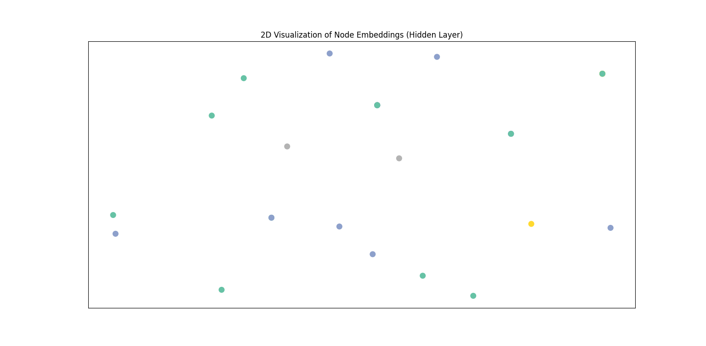

# Geometric Deep Learning Concepts

## What is Geometric Deep Learning?
Geometric Deep Learning (GDL) is a niche of machine learning tailored for data with complex underlying structures, such as graphs, manifolds, and meshes. Unlike traditional deep learning, which operates on Euclidean data (like images or text grids), GDL generalizes neural network operations to non-Euclidean domains.

## Difference from Standard Neural Networks
Standard Neural Networks (NNs) and Convolutional Neural Networks (CNNs) rely on regular grid structures (e.g., rigid arrays of pixels). They assume:
1. Fixed neighborhood size.
2. Ordered structure (left, right, up, down).
3. Translation invariance suitable for grids.

Graph data lacks these properties. Nodes can have arbitrary numbers of neighbors (irregularity), and there is no canonical ordering of nodes (permutation invariance). Applying a standard CNN to a graph is impossible because the "convolution" filter cannot slide over an irregular structure in a consistent way.

## Why MLPs are Insufficient for Graphs
A Multi-Layer Perceptron (MLP) processes each node in isolation or takes a flattened vector of the whole graph. 
1. **Isolation**: If processing node-by-node, the MLP ignores the connections (edges). It classifies a node based solely on its internal features, missing crucial relational context.
2. **Flattening**: If flattening the Adjacency matrix, the input size becomes fixed, preventing the model from handling graphs of different sizes. It also fails to capture the local inductive bias (locality) effectively.

## Basic Graph Concepts
*   **Graph (G)**: A set of nodes (vertices) and edges (links). G = (V, E).
*   **Adjacency Matrix (A)**: A matrix representation of connections. A[i][j] = 1 if node i and j are connected, else 0.
*   **Node Features (X)**: Attributes associated with each node (e.g., age, text embedding).
*   **Degree Matrix (D)**: A diagonal matrix where D[i][i] is the number of edges connected to node i.

## Neighborhood Aggregation (Message Passing)
The core mechanism of GDL is Message Passing. 
1.  **Message**: Each node sends its feature vector to its neighbors.
2.  **Aggregation**: Each node collects messages from its neighbors. A permutation-invariant function (like Sum, Mean, or Max) is used to combine these messages into a single vector.
3.  **Update**: The aggregated neighbor information is combined with the node's own current representation to update its state for the next layer.

Mathematically, for a node v and its neighbors N(v):
h_v_new = Update(h_v_old, Aggregate({h_u | u in N(v)}))

This allows information to propagate through the graph structure, enabling the model to learn from both node features and local topology.

## Results and Analysis

We compared a standard MLP (which ignores graph structure) against a GCN (which uses graph structure) on the Karate Club dataset.

### Quantitative Results

| Model | Accuracy | Explanation |
| :--- | :--- | :--- |
| **MLP (Baseline)** | **44.12%** | The MLP treats every student as an isolated individual. Since the input features are just identity matrices (unique IDs), the MLP forces itself to memorize labels for the training set but fails to generalize to unseen students. It cannot infer that "Node 2" is related to "Node 1". |
| **GCN (Geometric)** | **58.82%** | The GCN achieves significantly higher accuracy (**+14.7% improvement**). By aggregating information from neighbors, the GCN learns that students connected to "Faction A" members are likely to be in "Faction A" themselves, even if the model has never seen a label for those specific students. |

### Visual Analysis (Embeddings)

The project generates a t-SNE visualization of the node embeddings from the hidden layer (shown above).

1.  **Homophily**: You can observe that nodes (dots) corresponding to the same social factions (colors) are clustered tightly together. This indicates the model has learned that members of the same faction are "similar" in the graph structure.
2.  **Structural Learning**: Even though the GCN was only trained on **4 labeled nodes** (one per class), the embeddings for the *entire* graph naturally separated into 4 distinct clusters. This demonstrates that the GCN used the graph topology (who connects to whom) to propagate the label information to the rest of the network, effectively solving the problem for the unlabeled nodes.

### Conclusion

Standard NNs (MLPs) fail on graph data because they lack **Relational Inductive Bias**. They cannot "see" the connections. GCNs succeed because they explicitly model these connections, allowing them to solve the problem through **neighborhood aggregation** rather than improved feature engineering.
